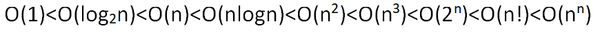

算法特性：输入、输出、有穷性、确定性、可行性

- 时间复杂度：常数阶、线性阶、对数阶、平方阶

  ```c++
  //线性阶 O(n)
  for(int i=0;i<n;i++){
      
  }
  ```

  ```c++
  //对数阶 O(log n) 底为2
  int count=1;
  while(count<n){
  	count *= 2;
  }
  ```

  ```c++
  //平方阶 O(n*n)
  for(int i=0;i<n;i++){
      for(int j=0;j<n){
          
      }
  }
  ```

  时间复杂度比较

  