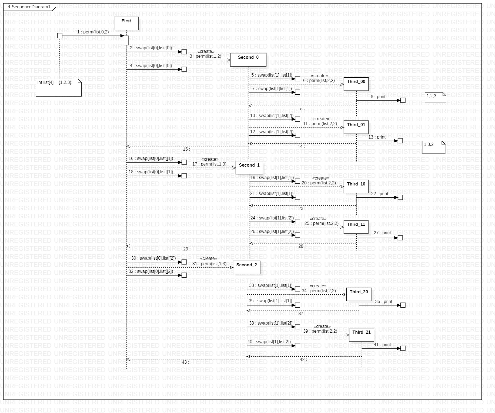

# 1.基本概念

## 1.1算法描述

### 1.1.1定义

- 输入：零个或多个输入。
- 输出：至少产生一个输出。
- 确定性：每条指令有明确语义，无歧义。
- 有限性：算法的任何一条执行路线都能在有限步内结束。（程序不满足此条件，可以无限执行）
- 有效性：每一条指令都必须足够简单，并且是可以执行的。

### 1.1.2例子

- 选择排序

  ```c
  void sort(int list[],int n){
    int i, j, min, temp;
    for(i = 0; i < n-1; i++){
      min = i;
      for(j = i+1; j < n; j++){
        if(list[j] < list[min])min = j;
      }
      swap(list[i],list[min],temp);
    }
  }
  ```

- 二分查找
  
  前提：数组 list 已经排序

  ```c
  int binSearch(int list[],int searchNum,int left,int right){
    int mid;
    while(left <= right){
      mid = (left + right) / 2;
      if(searchNum > list[mid]){
        left = mid + 1; //在右边
      }else if(searchNum < list[mid]){
        right = mid - 1;//在左边
      }else{
        return mid;     //找到了
      }
    }
    return -1;
  }
  ```

- 二分查找的递归实现
  
  ```c
  int binSearch(int list[],int searchNum,int left,int right){
    int mid;
    if(left <= right){
      mid = (left + right) / 2;
      if(searchNum > list[mid]){
        binSearch(list,searchNum,mid+1,right);
      }else if(searchNum < list[mid]){
        binSearch(list,searchNum,left,mid-1);
      }else{
        return mid;
      }
    }
    return -1;
  }
  ```

- 递归产生全排列
  
  

  ```c
  void perm(char *list, int i, int n){
    int j, temp;
    if(i == n){
      for(j = 0; j <= n; j++){
        printf("%c",list[j]);
      }
      printf("    ");
    }
    else{
      for(j = i; j <= n; j++){
        swap(list[i],list[j],temp);
        perm(list,i+1,n);
        swap(list[i],list[j],temp);
      }
    }
  }
  ```

- 矩阵乘法
  
  ```c

  ```