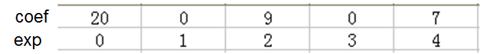
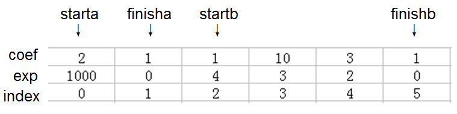
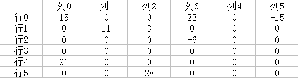
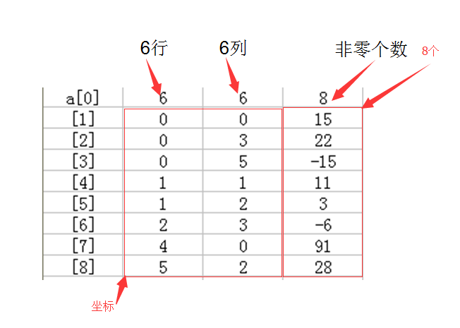

# 2 数组与结构

## 2.1 ADT数组

数组是由下标（索引）和值所组成的序对<index,value>集合。

其中每个有定义的下标，都存在一个与其关联的值。数学上称为对应（correspondence）或映射（mapping）。

大多数编程语言对数组只提供两种标准操作：检索一个值、存储一个值。

- ATD数组

  ```c
  structure Array is
  	object: a set of <index,value>. For every index,there is a value correspond to the index.Index is a finite set which has one or more dimention.
  functions:
  	For all A belong to Array,i belong to item,j,size belong to integer.
  	Array Create(j,list) ::= return an array with j dimenttion. 
  	Item Retrive(A,i)    ::= if(i belong to index)return the item attach to i in array ,else return false.
  	Array Store(A,i,x)   ::= if(i belong to index)return a new array(the original array add <i,x>),else return false.
  end Array
  ```
```c
  
C语言中
  
  > int list[5];
  >
  > list[0]的地址称为**基址**(base address)


- 一维数组寻址

  其中 ptr 为基址，以（基址 + 偏移）的方式进行寻址。

  ```c
  void print(int *ptr, int rows){
  	int i;
  	for(i = 0; i < rows; i++){
  		printf("%8u %5d\n",ptr+i,*(ptr+i));
  	}
  }
```

  对于数组 nums， 指向 nums[0] 的 ptr：nums[i] 等价于 *(ptr+i) 等价于 *(nums + i)。

  **数组名不能被赋值，但是可以拿来做加减。**

## 2.2 结构体、共用体

### 2.2.1 结构体

- 定义一个结构体，并且有个 person 实例。（person 可以直接使用）

  ```c
  struct {
	  char name[10];
	  int age;
  }person;
  ```
  
- 定义结构体，名称为student。并且有个 LiMing 实例。

  ```c
  struct Student{
  	char name[10];
  	int age;
  }LiMing;
  ```

  使用结构体时：

  ````c
  struct Student Mike;
  Mike.name = "Mike";
  Mike.age = 15;
  ````

- 使用 typedef 定义结构体，名称为 Teacher。

  ```c
  typedef struct Teacher{
  	char name[10];
      int age；
  };
  ```

  或者：

  ```c
  typedef struct{
  	char name[10];
      int age；
  }Teacher;
  ```

  使用结构体时：

  ```c
  Teacher Amy;
  Amy.name = "Amy";
  Amy.age = 28;
  ```

### 2.2.2 共用体

```c
typedef struct sex_type{
	enum tag-field{female,male} sex;
	union{
		int children;
		int beard;
	}u;
};
typedef struct human_being{
	char name[10];
	int age;
	float salary;
	double dob;
	sex_type sex_info;
};
```

使用时：

```c
human_being person1,person2;
person1.sex_info.sex = male;
person1.sex_info.u.beard = False;
person2.sex_info.sex = male;
person2.sex_info.u.children = 4;
```

### 2.2.3 结构体内部实现

```c
struct {int i,j; float a,b;};
```

存储顺序按地址升序。然而，为了使相邻分量在内存中对其，结构内可能出现空洞（hole）或填塞（padding）。

### 2.2.4 自引用结构

self-referential structure 

一种特殊的结构，它的一个或多个分量指向自身类型的指针。

```c
typedef struct list{
	char data;
	list *link;
};//链表雏形
```


## 2.3 ADT多项式

使用有序表来表示多项式，使用数组实现有序表。（**顺序映射 sequential mapping**）

假定有两个多项式AB。
$$
A(x)=\sum a_ix^i,B(x)=\sum b_ix^i
$$
那么：
$$
A(x)+B(x)=\sum (a_i+b_i)x^i
$$

$$
A(x)\times B(x)=\sum(a_ix^i\times \sum(b_ix^i))
$$

- ADT多项式

  ```c
  structure Polynomial is
  object: a set of <e,a>.The 'a' is coefficient,the e is nonegative integer.
  function:
  	for all the poly,poly1,poly2 belong to Polynomial,coef belong to Coefficents,expon belong to Exponents.
          Polynomial Zero()                     ::= return polynomial p(x) = 0
          Boolean IsZero(poly)                  ::= if(poly)return FALSE else return TRUE
          Coefficient Coef(poly,expon)          ::= if(expon belong to poly)return coef else return 0
          Exponent Lead_Exp(poly)               ::= return the max exponent of the poly
          Polynomial Attach(poly,coef,expon)    ::= if(expon belong to poly)return False else  return the poly behind <coef,expon>
          Polynomial Remove(poly,expon)         ::= if(expon belong to poly)return the poly after remove <coef,expon> else return FALSE
          Polynomial SingleMult(poly,coef,expon)::= return Polynomial:poly*coef*x^expon
          Polynomial Add(poly1,poly2)           ::= return Polynomial:poly1+poly2
          Polynomial Mult(poly1,poly2)          ::= return Polynomial:poly1*poly2
  end Polynomial
  ```

- 第一种表示方法
  $$
  A(x)=\sum _{i=0}^n a_i x^i =20+9x^2+7x^4
  $$

  


- 第二种表示方式
  
  $$
A(x)=2x^{1000}+1,B(x)=x^4+10x^3+3x^2+1
  $$
  
  

## 2.4 ADT稀疏矩阵

- 矩阵中含有许多0

  

- 稀疏矩阵表示

  

- 稀疏矩阵转置

  因为稀疏矩阵每一行的各个列

  需要找到第0列所有元素，并且把它们存储在转置矩阵的第0行、

  需要找到第1列所有元素，并且把它们存储在转置矩阵的第1行、

  需要找到第2列所有元素，并且把它们存储在转置矩阵的第2行......

  ```c
  //A-->>B
  void transpose(term a[],term b[]){
  	int n,i,j,currentB;
  	n = a[0].value;
  	b[0].row = a[0].col;
  	b[0].col = a[0].row;
  	b[0].value = a[0].value;
  	
  	if(n > 0){
  		//the matrix is not zero
  		currentB = 1;
  		for(i = 0; i < a[0].col; i++){
  			for(j = 0; j < a[0].row; j++){
  				if(a[j].col == i){
  					b[currentB].row = a[j].col;
                      b[currentB].col = a[j].row;
                      b[currentB].value = a[j].value;
                      currentB++;
  				}
  			}
  		}
  	}
  }
  ```

  

## 2.5 多维数组的存储表示

## 2.6 ADT字符串


